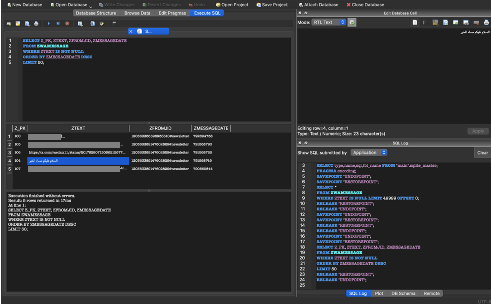
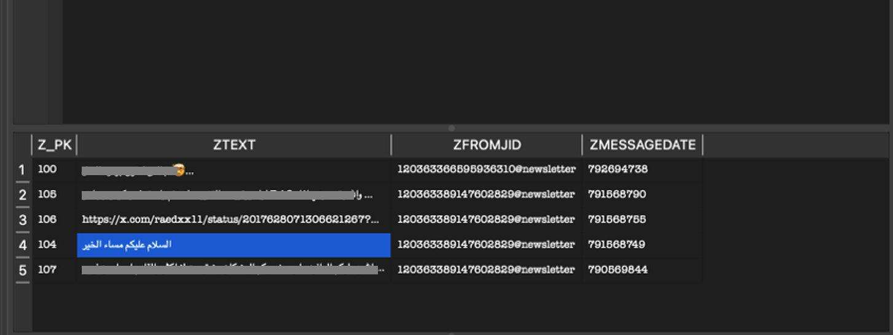
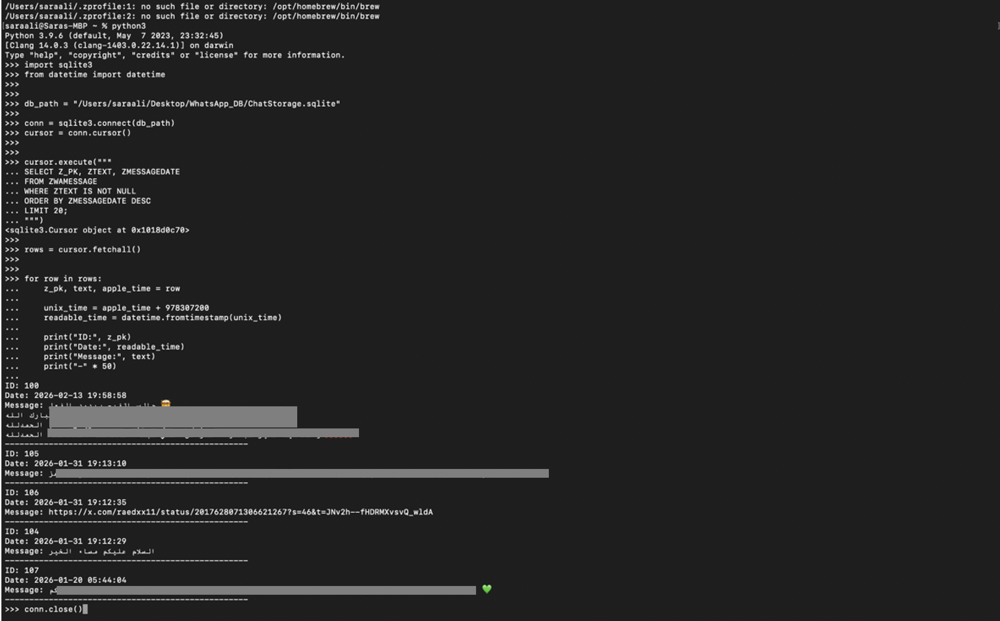
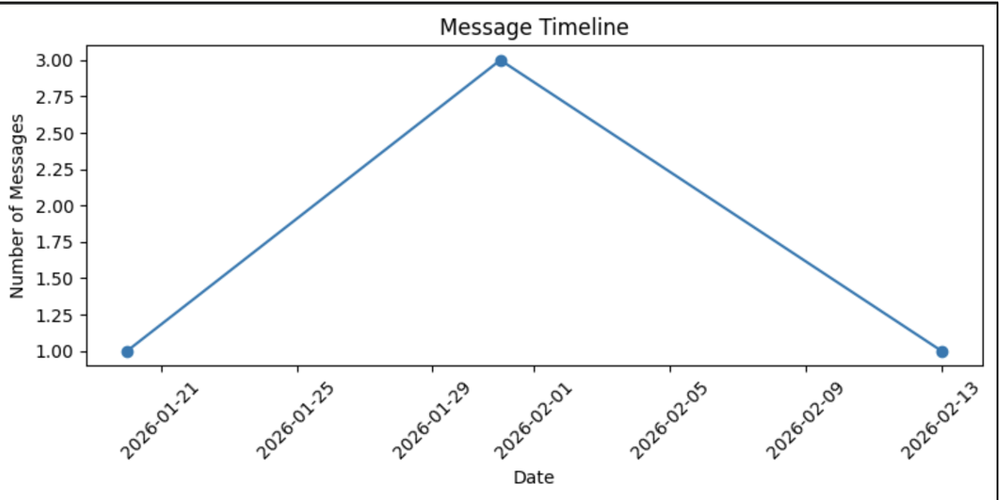
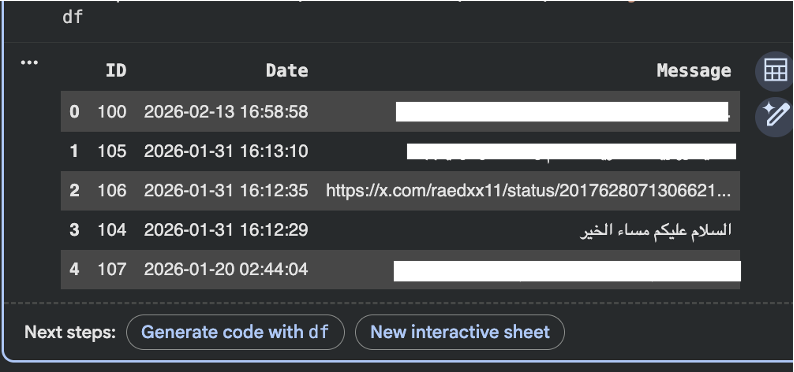

# WhatsApp iOS Forensic Analysis

## Overview
This project presents a forensic framework for extracting and reconstructing WhatsApp artifacts from encrypted iOS backups. The framework focuses on converting raw forensic data into structured and readable communication records for digital forensic investigations.

## Objectives
- Extract WhatsApp artifacts from encrypted iOS backups
- Convert Apple timestamps into readable timestamps
- Organize message records chronologically
- Improve forensic data interpretation

## Technologies Used
- iBackup Viewer
- DB Browser for SQLite
- Python
- Google Colab
- Pandas
- Matplotlib

## Project Structure
- `code/` : Python scripts and Google Colab implementation
- `screenshots/` : Figures, graphs, and forensic analysis screenshots
- `requirements.txt` : Required Python libraries
- `README.md` : Project documentation and description

## Dataset Description

The dataset used in this research was obtained from an encrypted iOS backup for forensic analysis purposes.

Due to privacy and ethical considerations, the original WhatsApp database is not publicly available.

The extracted artifacts include:
- Message content (ZTEXT)
- Message timestamps (ZMESSAGEDATE)
- Sender and receiver identifiers

---

## Methodology

The framework follows these steps:

1. Extract encrypted iOS backup
2. Locate WhatsApp database
3. Open SQLite database
4. Execute SQL queries
5. Convert Apple timestamps into Unix timestamps
6. Organize messages chronologically
7. Generate timeline visualization

---

## Key Contributions

- Developed a forensic framework for WhatsApp artifact reconstruction
- Converted Apple timestamps into human-readable format
- Organized forensic artifacts chronologically
- Improved forensic data readability and interpretation

---

## Reproducibility

To reproduce the results:

1. Extract the WhatsApp database from the encrypted iOS backup
2. Open the database using DB Browser for SQLite
3. Execute the SQL query to retrieve WhatsApp messages
4. Run the Python script for timestamp conversion
5. Generate the timeline visualization using Google Colab

---
## Results

The proposed forensic framework successfully extracted and reconstructed WhatsApp artifacts from an encrypted iOS backup.

The extracted data included:
- Message content
- Sender and receiver identifiers
- Message timestamps

Apple Epoch timestamps were converted into human-readable format using Python, which improved the interpretability of the extracted forensic artifacts.

The generated timeline visualization helped identify communication patterns and chronological user activity.

---

### SQL Query Execution

This figure shows the SQL query used to extract WhatsApp message artifacts from the SQLite database.

---

### Raw Extracted Data

This figure presents the raw WhatsApp records before timestamp normalization.

---

### Timestamp Conversion

This figure demonstrates the Python-based conversion of Apple timestamps into human-readable format.

---

### Processed WhatsApp Messages

This figure shows the processed WhatsApp messages after timestamp conversion and structuring.

---

### Message Timeline Distribution

This figure presents the chronological distribution of extracted WhatsApp messages over time.

## Data Availability
The dataset used in this research was obtained from an encrypted iOS backup for forensic analysis purposes.

Due to privacy and ethical considerations, the original forensic dataset is not publicly shared.

Sample outputs, screenshots, and implementation files are available in this repository.

## GitHub Repository
Add your repository link here.

## DOI
Add your DOI link here after generating it from Zenodo.

